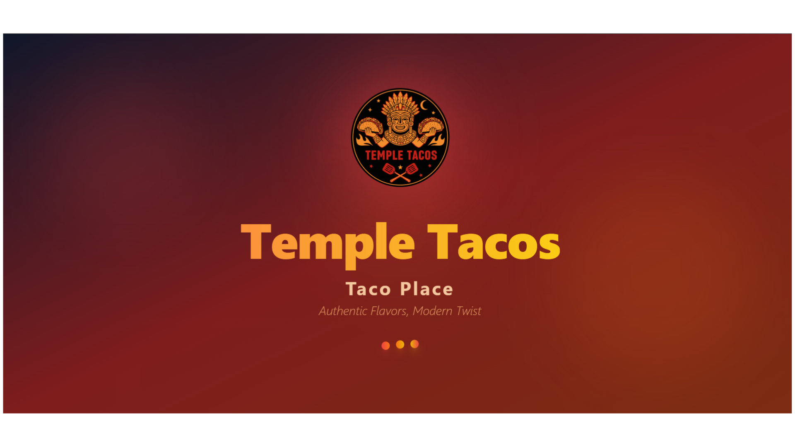
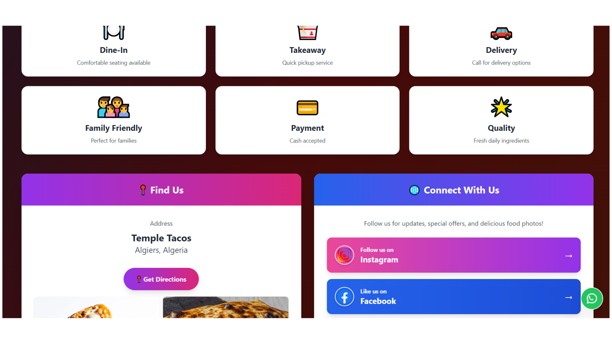
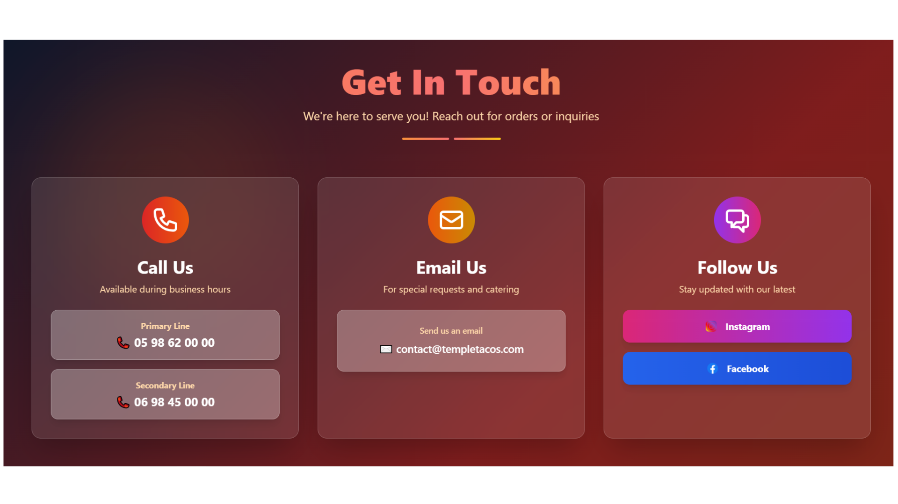
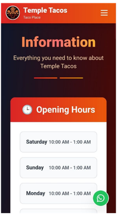
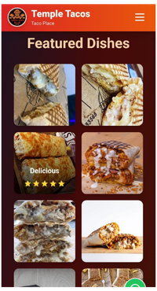
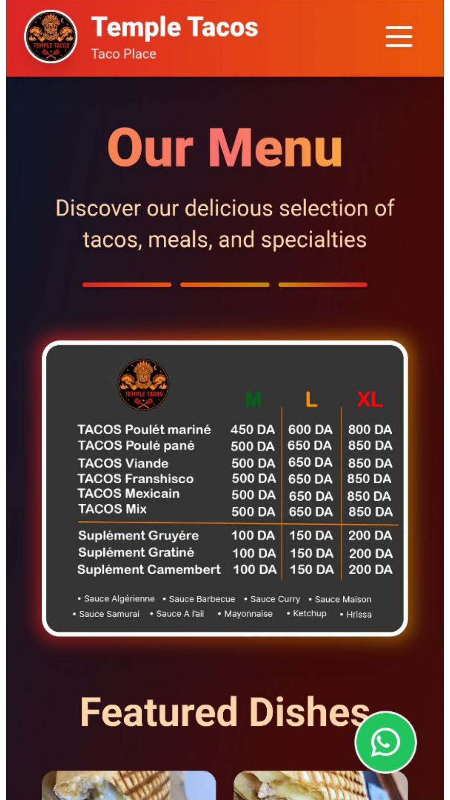
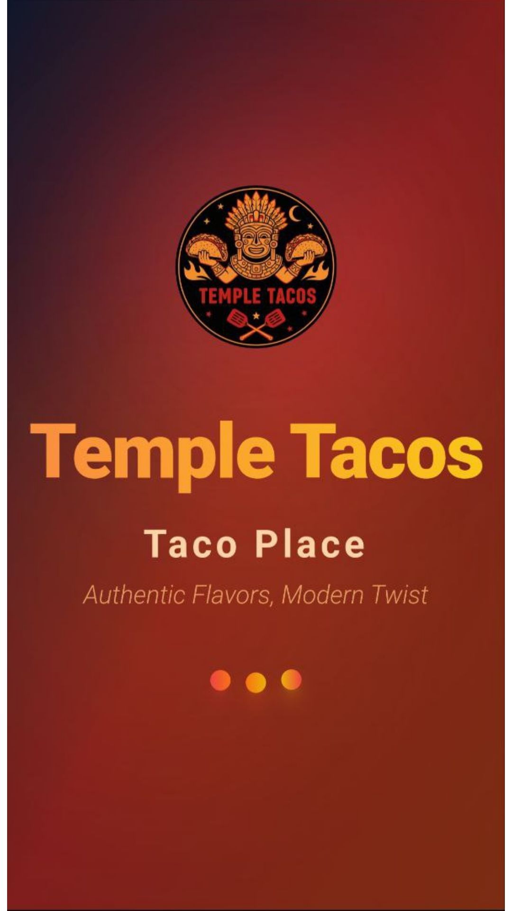

# Temple Tacosfgh

## 🌟 Live Project

**Agency Website:** [https://temple-tacos.vercel.app/](https://temple-tacos.vercel.app/)

## 📋 Project Overview

Temple Tacos is a modern restaurant showcase website project that I built as a professional full stack web developer to demonstrate UI engineering, frontend architecture, and production-level web best practices.

> Important: **Temple Tacos is not a real restaurant**. This is a portfolio/demo project created to showcase my development skills.

### 📸 Screenshots









## Live Website Features

- Modern splash screen and branded layout
- Desktop and mobile optimized navigation experience
- Dedicated content sections: Menu, Services, Contact, and Info
- Contact CTAs with phone and email actions
- Floating WhatsApp-style order prompt (UI-only)
- Rich image-driven restaurant presentation
- Footer branding and creator attribution

## Tech Stack

- **Frontend:** React 18 + TypeScript
- **Build Tooling:** Vite 7
- **Styling:** Tailwind CSS + custom CSS
- **Code Quality:** ESLint + TypeScript type checking
- **Package Management:** npm

## SEO, Security & Performance Best Practices Included

### SEO

- Semantic page title and metadata for discoverability
- Open Graph and Twitter metadata for social previews
- `robots.txt` and `sitemap.xml` for crawler guidance
- JSON-LD structured data (`WebSite`) in `index.html`
- Web App Manifest (`site.webmanifest`) for installability metadata

### Security

- Content Security Policy (CSP) meta policy
- `X-Content-Type-Options`, `X-Frame-Options`, and `Permissions-Policy`
- Strict referrer policy
- Vercel deployment headers configured in `vercel.json`

### Performance

- Vite optimized production build pipeline
- CSS code splitting and module preload configuration
- Preloaded key image asset (`/icon.png`)
- Immutable cache headers for built assets (Vercel)

## Project Structure

```text
n-rtacos/
├─ public/
│  ├─ icon.png
│  ├─ menu.png
│  ├─ image*.png|jpg
│  ├─ robots.txt
│  ├─ sitemap.xml
│  └─ site.webmanifest
├─ src/
│  ├─ App.tsx
│  ├─ main.tsx
│  ├─ index.css
│  └─ components/
│     ├─ layout/
│     │  ├─ Header.tsx
│     │  ├─ Navbar.tsx
│     │  └─ SplashScreen.tsx
│     └─ sections/
│        ├─ Menu.tsx
│        ├─ Service.tsx
│        ├─ Contact.tsx
│        └─ Info.tsx
├─ index.html
├─ vite.config.ts
├─ vercel.json
└─ README.md
```

## Run Locally

```bash
npm install
npm run dev
```

## Build for Production

```bash
npm run build
npm run preview
```

## 📄 License

This project is licensed under the MIT License - see the [LICENSE](LICENSE) file for details.

## Future Improvement Idea

I can extend this project by adding a full **order-taking system**, including:

- Customer ordering flow
- Database integration
- Admin dashboard for order management
- Real-time order status updates
- Analytics and reporting capabilities
